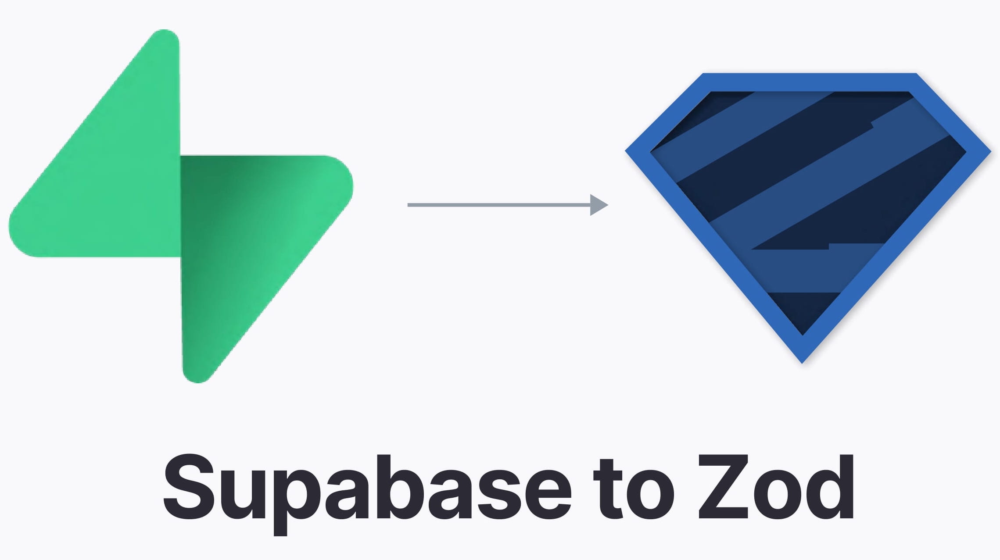

# supabase-to-zod

<div align="center">
  
  <h1 align="center">supabase-to-zod</h1>
</div>

Generate [Zod](https://github.com/colinhacks/zod) schemas (v3) from Typescript types generated by the Supabase CLI.

[](https://npmjs.org/package/supabase-to-zod)
[](https://github.com/psteinroe/supabase-to-zod/blob/main/LICENSE)

## Usage

```sh
$ pnpm add --D supabase-to-zod
$ supabase gen types typescript --local > types.ts
$ pnpm supabase-to-zod --input types.ts --output schemas.ts
```

That's it, go to `types.ts` file, you should have a schema for all tables, views, enums and functions.
